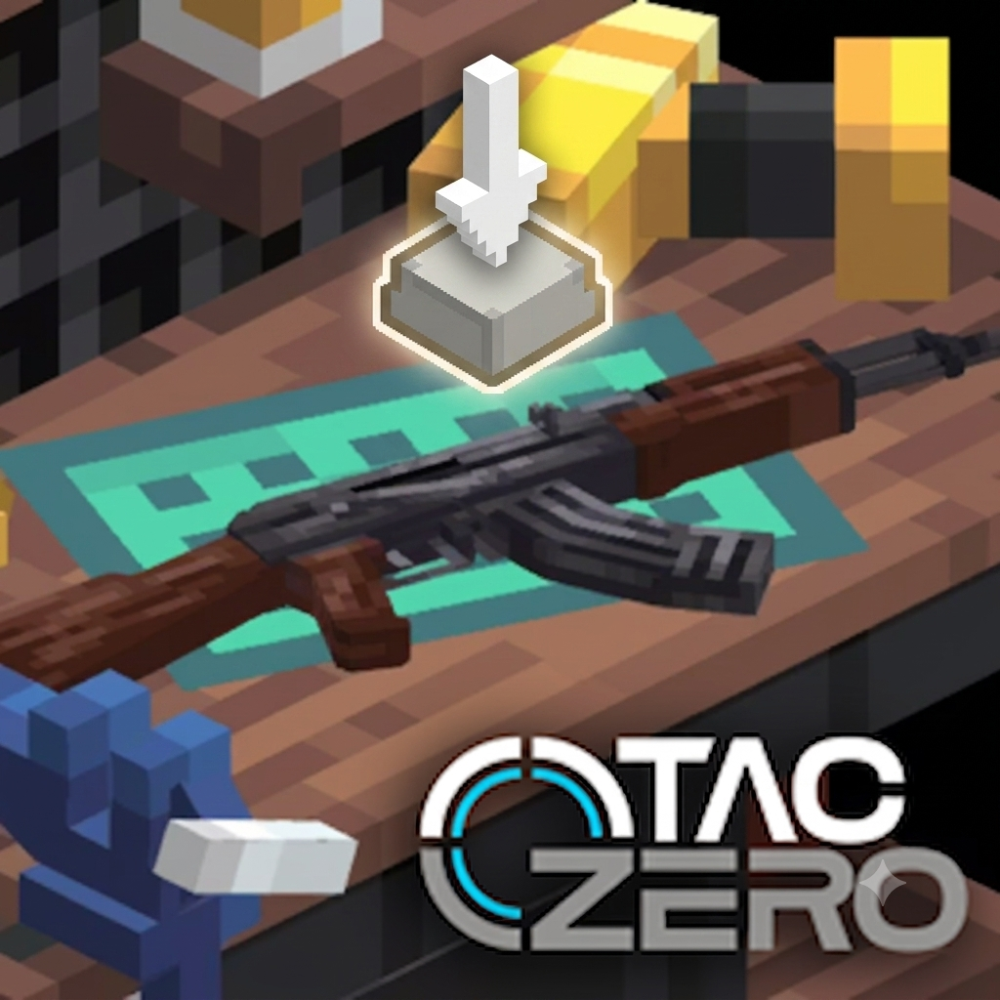

# Neo TaCZ Interact

  

**Neo TaCZ Interact** is a client-side and server-side mod for **NeoForge 1.21.1** that fixes interaction issues when holding a gun in **TaCZ 1.21.1 NeoForge Port (TaCZ)**.

## Features

- **Seamless Interaction:** Allows you to seamlessly interact with doors, levers, chests, and other blocks using the TACZ Interact Key (default `F`) while holding a gun.

## ⚙Requirements

- Minecraft 1.21.1
- NeoForge (21.1.x)
- [TaCZ 1.21.1 NeoForge Port](https://modrinth.com/mod/tacz-1.21.1) for 1.21.1

## Installation

1. Download the latest `.jar` file from the [Releases](https://github.com/kleqing/Neo-TaCZ-Interact/releases) page.
2. Place the downloaded `.jar` file into your Minecraft `mods/` folder.
3. Make sure you also have TACZ installed!

## How it works

When you hold a gun in TACZ, right-clicking is reserved for aiming. TACZ provides an "Interact Key" (default `F`) to allow you to interact with blocks and entities without un-equipping your weapon.

## Credits
- JetBrains for IntelliJ IDEA
- Original inspiration from [Tac interact key](https://www.curseforge.com/minecraft/mc-mods/tac-interact-key)
- Claude code for fixing bug and improved UI